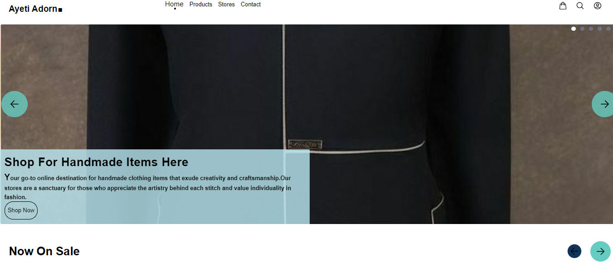

## Ayeti Adorn

#### Description:  E-commerce web application built with the MERN Stack, with 3 mode of payment using Flutterwave, Paystack or Stripe. 
___

#### Link to the live website: [Ayeti-Adorn](https://ayeti-aorn.onrender.com/ "Ayeti Adorn live site")
___

#### Frontend Design:  Freestyled it : ) 

___

### ✨ Built With:
1. React
2. Cloudinary
3. NodeJS
4. ExpressJS
5. Git
6. Github
7. MongoDB
8. JWT
9. Bcrypt
10. Express Rate limiter
11. Nodemailer
12. Render
13. React-router
14. Tailwind
15. swr
___

### 📚 Getting Started

#### 🛠️ Installation
1. Clone the project or download zip file
2. Navigate to the project directory
   ```bash
   cd E-commerce
   ```
3. Navigate to the respective client and server directory
   ```bash
   cd client
   ```
   ```bash
   cd server
   ```
4. Install dependencies with ``` npm install ```
5. Use ```.env_sample``` to configure the ```.env``` 
6. Run ```npm start ``` in the client directory and ``` npm run dev ``` in the server directory
> NB: In client directory ``` package.json ```, it's been proxied to localhost:5000, change depending on backend PORT number
   
### Client Side
1. Pages -19
2. Icons - idk:(
3. Components - >13 

### Server Side / API
#### NB:
1. "*" -- compulsory field
2. "?" -- optional field
3. Authorization roles - Admin, Seller, User
#### Authentication
Authentication is enabled in this app using JWT and cookies.
Token is sent with each request, that requires authentication and it's verified on the server.

1. Endpoint to register user
```JSON
POST: {{DOMAIN}}/api/v1/auth/register
{
    "name" *: "your name",
    "email" *: "youremail@something.com",
    "password" *: "yourpassword"
}
```
2. Endpoint to verify email
```JSON
POST: {{DOMAIN}}/api/v1/auth/verify-email
{
   "verificationToken" *: "verification token sent with mail", 
   "email" *: "your email"
}
```
2. Endpoint to login user
```JSON
POST: {{DOMAIN}}/api/v1/auth/login
{
   "email" *: "your email",
   "password" *: "uour password",
}
```
3. Endpoint to logout
```JSON
GET:{{DOMAIN}} /api/v1/auth/logout
{}
```
4. Endpoint for forgot password
```JSON
POST: {{DOMAIN}}/api/v1/auth/forgot-password
{
   "email" *: "your email"
}
```
5. Endpoint for reset password 
```JSON
POST: {{DOMAIN}}/api/v1/auth/reset-password
{
   "email" *: "your email"
}
```

#### Users
1. Endpoint to get all user (Admin)
```JSON
GET: {{DOMAIN}}/api/v1/user
{}
```
2. Endpoint to get single user 
```JSON
GET: {{DOMAIN}}/api/v1/user/user-id
{}
```
3. Endpoint to show current user
```JSON
GET: {{DOMAIN}}/api/v1/users/show
{}
```
4. Endpoint to update user
```JSON
PATCH: {{DOMAIN}}/api/v1/user/update
{
    "name" ?: "new name",
    "email" ?: "new email",
    "avatar" ?: "new profile pic"
}
```
5. Endpoint to update user password
```JSON
PATCH: {{DOMAIN}}/api/v1/user/updatePwd
{
    "oldPassword" *: "yourpassword",
    "newPassword" *: "yournewpassword",
}
```
6. Endpoint to block/unblock user (Admin)
```JSON
PATCH: {{DOMAIN}}/api/v1/user/user-id
{}
```
#### Products
1. Endpoint to get create product (Admin, Seller) 
```JSON
POST: {{DOMAIN}}/api/v1/products
{   
    "name" *: "Product Name",    
    "category" *: "kids/women/men/unisex",   
    "desc" *: "Description of product"
}
```
2. Endpoint to get all products (Admin)
```JSON
GET: {{DOMAIN}}/api/v1/products
{}
```
3. Endpoint to get single product
```JSON
// For users
GET: {{DOMAIN}}/api/v1/products/auth/product-id
{}
```
```JSON
// For visitors
GET: {{DOMAIN}}/api/v1/products/product-id
{}
```
4. Endpoint to delete product (Admin, Seller)
```JSON
DELETE: {{DOMAIN}}/api/v1/products/product-id
{}
```
5. Endpoint to update product (Admin, Seller)
```JSON
PATCH: {{DOMAIN}}/api/v1/products/product-id
{
    "name" ?: "Product Name",    
    "category" ?: "kids/women/men/unisex",   
    "desc" ?: "Description of product"
}
```
6. Endpoint to like/unlike product
```JSON
PATCH: {{DOMAIN}}/api/v1/products/product-id
{}
```
7. Endpoint to get current user products (Admin, Seller)
```JSON
GET: {{DOMAIN}}/api/v1/products/my-products
{}
```

#### Stores
1. Endpoint to create store
```JSON
POST: {{DOMAIN}}/api/v1/store
{   
    "name" *: "Store Name",      
    "desc" *: "Description of store"
}
```
2. Endpoint to get all stores
```JSON
GET: {{DOMAIN}}/api/v1/store
{}
```
3. Endpoint to get single store
```JSON
GET: {{DOMAIN}}/api/v1/store/store-id
{}
```
4. Endpoint to add get seller store (Admin, seller)
```JSON
GET: {{DOMAIN}}/api/v1/store
{}
```
5. Endpoint to update store (Admin, Seller)
```JSON
PATCH: {{DOMAIN}}/api/v1/store/store-id
{
     "name" ?: "store new name", 
     "desc" ?: "store new description", 
     "insta" ?: "link to store instagram page", 
     "fb" ?: "link to store facebook page", 
     "tiktok" ?: "link to store tiktok page", 
     "open": "Boolean(true/ false)" 
}
```
6. Endpoint to delete store (Admin, Seller)
```JSON
DELETE: {{DOMAIN}}/api/v1/store/store-id
{}
```

#### Reviews
1. Endpoint to get create review 
```JSON
POST: {{DOMAIN}}/api/v1/reviews
{ 
    "title" *: "Review title",
    "comment" *: "Review Comment",
    "rating" *: 5,(Number 1-5 )    
    "product" *: "product ID"
}
```
2. Endpoint to get all reviews
```JSON
GET: {{DOMAIN}}/api/v1/reviews
{}
```
3. Endpoint to get single review
```JSON
GET: {{DOMAIN}}/api/v1/reviews/review-id
{}
```
4. Endpoint to update review
```JSON
PATCH: {{DOMAIN}}/api/v1/reviews/review-id
{
    "title" ?: "New Review title",
    "comment" ?: "New Review Comment",
    "rating" ?: 1,(Number 1-5 )   
}
```
5. Endpoint to delete review
```JSON
DELETE: {{DOMAIN}}/api/v1/reviews/review-id
{}
```

#### Orders
1. Endpoint to get all orders 
```JSON
GET: {{DOMAIN}}/api/v1/orders
{}
```
2. Endpoint to single order
```JSON
GET: {{DOMAIN}}/api/v1/orders/order-id
{}
```
3. Endpoint to current user order history
```JSON
GET: {{DOMAIN}}/api/v1/orders/showCurrentUserOrder
{}
```
4. Endpoint to get current vendor sales (Admin, Seller)
```JSON
GET: {{DOMAIN}}/api/v1/orders/showCurrentUserSales
{}
```
5. Endpoint to create order
```JSON
POST: {{DOMAIN}}/api/v1/orders
{
    "email" ?: "your name",
    "name" ?: "your email",
    "address" *: "your address",
    "city" *: "your city",
    "country" *: "your country",
    "cartItems" *: [
        {
            "product": "product ID","name": "Product 1", "amount": 2, "image": "/uploads/example.jpeg", "price":200 
        },
        {
            "product": "product ID","name": "Product 2", "amount": 1, "image": "/uploads/example.jpeg", "price": 400
        }
    ],
    "shippingFee": 20
},
```
6. Endpoint to update order (Admin)
```JSON
PATCH: {{DOMAIN}}/api/v1/orders/order-id
{
    "status" *: "paid" 
    ["pending", "failed", "paid", "delivered", "canceled"],
    "payStackAccessCode" ?: "paystack access code",
    "stripeClientSecret" ?: " stripe client secret",
    "flutterTrxId" ?: "flutter wave transaction id"
},
```
   
#### Payment
1. Paystack 
```JSON
1. Accept Payment: 
POST: {{DOMAIN}}/api/v1/payment/paystack/acceptPayment
{
  "email" *: "youremail", 
  "amount" *: "amount to be paid in (Naira)", 
  "ref" ?: "unique reference id" 
},

2. Verify
GET: {{DOMAIN}}/api/v1/payment/paystack/reference-id
{},
```
2. Stripe
```JSON
1. Create Payment Intent: 
POST: {{DOMAIN}}/api/v1/payment/stripe/create-payment-intent
{
    "total" *: "cart total", 
    "shipping" ?: "shipping fee", 
    "id" *: "order ID"
},

2. Verify
GET: {{DOMAIN}}/api/v1/payment/stripe/verifyPayment/{{transaction-id}}/{{orderId}}
{},
```
  
3. Flutterwave
```JSON
1. Accept Payment: 
POST: {{DOMAIN}}/api/v1/payment/flutterwave/acceptPayment
{
  "name" *: "customers name",
  "email" *: "customers email", 
  "amount" *: "amount to be paid in (Naira)", 
  "ref" *: "unique reference id, usually order id" 
},

2. Verify Payment:
GET: {{DOMAIN}}/api/v1/payment/paystack/reference-id
{},
```

#### Future Feature
1. Paginate the product page
2. Send email when payment is successful